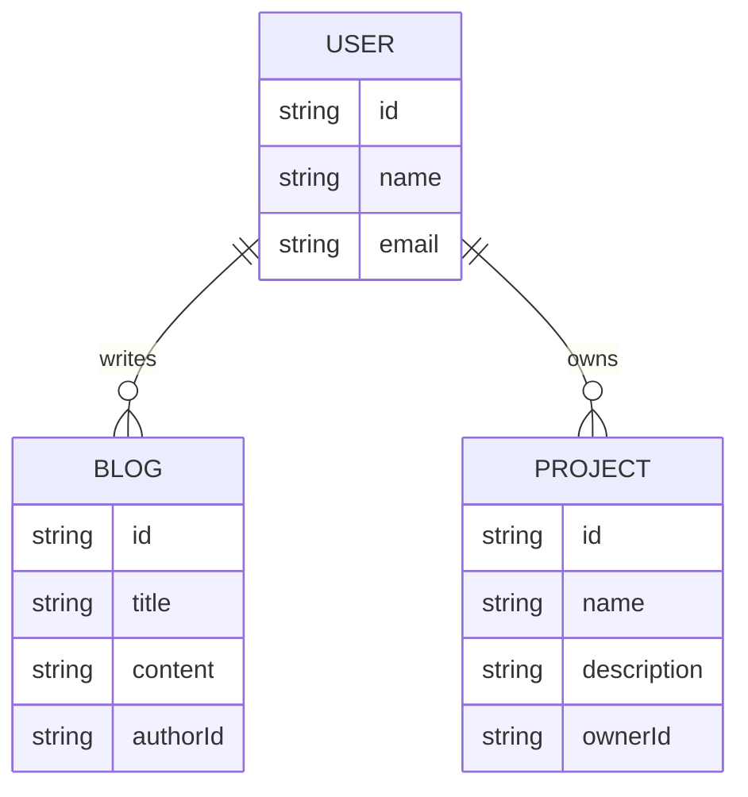

# Entity Relationship Diagram

```mermaid
erDiagram
    USER {
      string id
      string name
      string email
    }
    BLOG {
      string id
      string title
      string content
      string authorId
    }
    PROJECT {
      string id
      string name
      string description
      string ownerId
    }
    USER ||--o{ BLOG : writes
    USER ||--o{ PROJECT : owns
```
